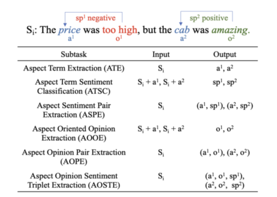

# Aspect-Based Sentiment Analysis (ABSA)

## Overview

This project focuses on **Aspect-Based Sentiment Analysis (ABSA)**, which aims to extract specific aspects from textual data and determine their associated sentiment. ABSA has broad applications in analyzing product reviews, service feedback, and customer opinions.

## Key Tasks

The project addresses the **Aspect Sentiment Pair Extraction (ASPE)** problem through two main steps:

1. **Aspect Term Extraction (ATE):** Identifying aspect terms in the input text.
2. **Aspect Term Sentiment Classification (ATSC):** Predicting the sentiment of the extracted aspect terms.

## Dataset

The experiments are conducted on the **SemEval-2014 Task 4: Aspect-Based Sentiment Analysis** dataset. Preprocessing steps include punctuation removal, normalization, and tokenization.

## Implementation Details

### 1. Aspect Term Extraction (ATE)

- Uses **sequence labeling models** commonly applied in **Named Entity Recognition (NER)** and **POS tagging**.
- Model: **DistilBERT-based token classification**.
- Training accuracy: **81.73%**.

### 2. Aspect Term Sentiment Classification (ATSC)

- Uses a **sequence classification model** to predict the sentiment of each extracted aspect.
- Model: **DistilBERT-based sequence classification**.
- Training accuracy: **79.18%**.

## Model Training

- **Tokenization**: Utilizing `transformers` library for text preprocessing.
- **Training Framework**: Fine-tuning **DistilBERT** using `Trainer` from `Hugging Face Transformers`.
- **Evaluation Metrics**: Accuracy scores based on `seqeval` and `evaluate` libraries.

## Deployment

- The trained model is deployed as a web application using **Streamlit**.
- Demo: [Aspect-Based Sentiment Analysis App](https://aspect-based-sentiment-analysis-app-mhdzmq6mrj4ssfsiafznh5.streamlit.app/)

## References

- [SemEval-2014 Task 4](https://aclanthology.org/S14-2004/)
- [Hugging Face Transformers](https://huggingface.co/transformers/)
- [Pretrained Model - DistilBERT](https://huggingface.co/distilbert-base-uncased)
